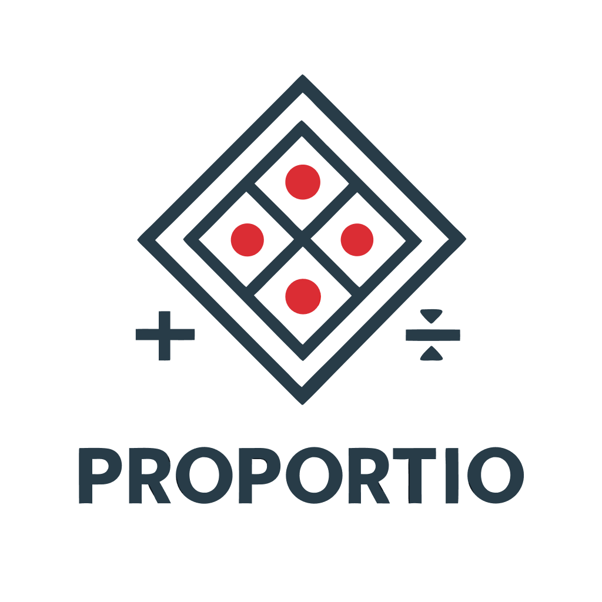

# PROPORTIO MCP SERVER - Mathematical Precision Calculator

<div align="center">
  
</div>

[](LICENSE)
[](https://python.org)
[](Dockerfile)
[](tests/)
[](https://modelcontextprotocol.io)

**Professional mathematical calculations for proportions, percentages, and scaling operations with assertion-based validation and MCP server integration.**

---

## 📋 Table of Contents

- [🎯 Overview](#-overview)
- [✨ Features](#-features)
- [🚀 Quick Start](#-quick-start)
- [🔧 Core Functions](#-core-functions)
- [🏗️ Architecture](#️-architecture)
- [📦 Installation](#-installation)
- [🐳 Docker Deployment](#-docker-deployment)
- [🧪 Testing](#-testing)
- [🔌 MCP Integration](#-mcp-integration)
- [📖 API Reference](#-api-reference)
- [🛠️ Development](#️-development)
- [📝 License](#-license)

---

## 🎯 Overview

Proportio is a specialized mathematical calculation server designed for LLM agents and applications requiring precise proportion calculations. Built with **assertion-based validation** and **zero-tolerance error handling**, it provides reliable mathematical operations through both a web interface and Model Context Protocol (MCP) integration.

### Key Use Cases

- **Recipe Scaling**: Scale ingredient quantities for different serving sizes
- **Financial Calculations**: Calculate percentages, ratios, and proportional growth
- **Engineering**: Resize dimensions, scale measurements, and maintain proportional relationships  
- **Data Analysis**: Compute percentages, ratios, and proportional transformations
- **LLM Integration**: Provide reliable mathematical operations through MCP protocol

---

## ✨ Features

### 🔢 Mathematical Functions
- **Percentage Calculations** - Convert parts to percentages with precision
- **Proportion Solving** - Solve missing terms in a/b = c/d relationships
- **Ratio Scaling** - Scale values by precise ratios
- **Proportionality Constants** - Find k in y = kx relationships
- **Dimension Resizing** - Uniform scaling of width/height pairs

### 🛡️ Validation Architecture
- **Assertion-Based Validation** - Explicit mathematical preconditions
- **Zero Exception Handling** - No try-catch blocks, fast failure detection
- **Precise Error Messages** - Clear, actionable error descriptions
- **Type Safety** - Robust input validation and type checking

### 🌐 Integration Options
- **Web Interface** - Professional Gradio-based UI with custom branding
- **MCP Server** - Native Model Context Protocol support for LLM agents
- **Docker Ready** - Containerized deployment with security best practices
- **API Access** - Direct function calls with comprehensive documentation

### 🎨 Professional Design
- **Custom Branding** - Red-black-white theme with geometric logo
- **Responsive Layout** - Optimized for desktop and mobile devices
- **Split Results** - Clear separation of input/output sections
- **Error Handling** - User-friendly error messages and validation

---

## 🚀 Quick Start

### Using Docker (Recommended)

```bash
# Clone the repository
git clone https://github.com/leksval/proportio.git
cd proportio

# Build and run with Docker
docker build -t proportio-server .
docker run -p 7860:7860 proportio-server

# Access the web interface
open http://localhost:7860
```

### Local Development

```bash
# Install dependencies
pip install -r requirements.txt

# Run the server
python proportion_server.py

# Access the web interface
open http://localhost:7860
```

### Quick Function Examples

```python
from proportion_server import percent_of, solve_proportion, resize_dimensions

# Calculate percentage
result = percent_of(25, 100)  # Returns: 25.0

# Solve proportion: 3/4 = 6/?
result = solve_proportion(3, 4, 6, None)  # Returns: 8.0

# Resize dimensions by 2x
width, height = resize_dimensions(100, 50, 2.0)  # Returns: (200.0, 100.0)
```

---

## 🔧 Core Functions

### 1. **`percent_of(part, whole)`**
Calculate what percentage the part is of the whole.

```python
percent_of(25, 100)     # → 25.0%
percent_of(3, 4)        # → 75.0%
percent_of(150, 100)    # → 150.0%
```

**Mathematical Preconditions:**
- `whole != 0` (division by zero protection)

**Real-world Examples:**
- Sales conversion rates
- Test score percentages  
- Growth rate calculations

### 2. **`solve_proportion(a, b, c, d)`**
Solve missing term in proportion a/b = c/d (exactly one parameter must be None).

```python
solve_proportion(3, 4, 6, None)      # → 8.0  (3/4 = 6/8)
solve_proportion(None, 4, 6, 8)      # → 3.0  (?/4 = 6/8)
solve_proportion(2, None, 6, 9)      # → 3.0  (2/? = 6/9)
```

**Mathematical Preconditions:**
- Exactly one value must be None (missing)
- Division denominators != 0 (varies by missing value)

**Real-world Examples:**
- Recipe scaling (4 servings : 2 cups = 6 servings : ? cups)
- Currency exchange rates
- Map scale calculations

### 3. **`scale_by_ratio(value, ratio)`**
Scale a value by a given ratio.

```python
scale_by_ratio(100, 1.5)    # → 150.0
scale_by_ratio(200, 0.5)    # → 100.0
scale_by_ratio(50, 2.0)     # → 100.0
```

**Use Cases:**
- Applying discount percentages
- Scaling measurements
- Financial calculations

### 4. **`direct_k(x, y)`**
Find proportionality constant k in direct variation y = kx.

```python
direct_k(5, 15)     # → 3.0  (15 = 3 × 5)
direct_k(4, 12)     # → 3.0  (12 = 3 × 4)
direct_k(2, 7)      # → 3.5  (7 = 3.5 × 2)
```

**Mathematical Preconditions:**
- `x != 0` (division by zero protection)

**Applications:**
- Physics calculations (force = k × displacement)
- Economics (cost = k × quantity)
- Engineering (stress = k × strain)

### 5. **`resize_dimensions(width, height, scale)`**
Resize dimensions with uniform scale factor.

```python
resize_dimensions(100, 50, 2.0)    # → (200.0, 100.0)
resize_dimensions(200, 100, 0.5)   # → (100.0, 50.0)
resize_dimensions(150, 75, 1.5)    # → (225.0, 112.5)
```

**Mathematical Preconditions:**
- `width >= 0` (dimensions must be non-negative)
- `height >= 0` (dimensions must be non-negative)  
- `scale > 0` (scale factor must be positive)

**Applications:**
- Image resizing
- Screen resolution scaling
- Architectural drawings

---

## 🏗️ Architecture

### Assertion-Based Validation

Proportio uses **assertion-based validation** throughout, providing several key advantages:

```python
def percent_of(part: float, whole: float) -> float:
    # Mathematical preconditions
    assert whole != 0, "Division by zero: whole cannot be zero"
    
    # Direct calculation
    percentage = (part / whole) * 100
    return percentage
```

**Benefits:**
- **Fast Failure**: Immediate error detection with precise messages
- **No Exception Overhead**: Zero try-catch complexity
- **Clear Preconditions**: Mathematical requirements explicitly documented
- **Predictable Behavior**: Consistent error handling across all functions

### Project Structure

```
proportio/
├── proportion_server.py    # Core mathematical functions + Gradio server
├── models.py              # Pydantic data models (simplified)
├── config.py              # Configuration and logging setup
├── styles.css             # Custom branding and responsive design
├── tests/
│   └── test_tools.py      # Comprehensive test suite (58 tests)
├── requirements.txt       # Minimal dependencies (3 packages)
├── Dockerfile            # Single-stage containerization
└── README.md             # This documentation
```

### Dependency Architecture

**Streamlined Dependencies** (only 3 required):
- **`gradio[mcp]>=5.0.0`** - Web framework with MCP server capabilities
- **`pydantic>=2.8.0`** - Data validation and parsing
- **`pytest>=8.0.0`** - Testing framework

### Error Handling Philosophy

**No Try-Catch Blocks** - All validation done through assertions:

```python
# ❌ Old approach (complex exception handling)
try:
    if whole == 0:
        raise ValueError("Division by zero")
    result = part / whole
except ValueError as e:
    # Handle error...

# ✅ New approach (assertion-based)
assert whole != 0, "Division by zero: whole cannot be zero"
result = part / whole
```

---

## 📦 Installation

### System Requirements

- **Python 3.11+**
- **pip** package manager
- **Docker** (optional, for containerized deployment)

### Local Installation

```bash
# Clone repository
git clone https://github.com/leksval/proportio.git
cd proportio

# Create virtual environment (recommended)
python -m venv venv
source venv/bin/activate  # On Windows: venv\Scripts\activate

# Install dependencies
pip install -r requirements.txt

# Verify installation
python -c "from proportion_server import percent_of; print(percent_of(25, 100))"
```

### Development Installation

```bash
# Install with development dependencies
pip install -r requirements.txt

# Run tests to verify setup
python -m pytest tests/test_tools.py -v

# Start development server
python proportion_server.py
```

---

## 🐳 Docker Deployment

### Building the Container

```bash
# Build image
docker build -t proportio-server .

# Run container
docker run -p 7860:7860 proportio-server

# Run with custom configuration
docker run -p 8080:7860 -e PORT=7860 proportio-server
```

### Container Features

- **Security**: Non-root user execution
- **Optimization**: Single-stage build for minimal image size
- **Flexibility**: Configurable port and environment settings
- **Health**: Automatic process management

### Production Deployment

```bash
# Run detached with restart policy
docker run -d \
  --name proportio \
  --restart unless-stopped \
  -p 7860:7860 \
  proportio-server

# View logs
docker logs proportio

# Stop container
docker stop proportio
```

---

## 🧪 Testing

### Test Suite Coverage

**58 comprehensive tests** covering:
- ✅ Basic functionality for all 5 core functions
- ✅ Edge cases and boundary conditions
- ✅ Error handling and assertion validation
- ✅ Integration workflows and chained calculations
- ✅ Floating-point precision and mathematical accuracy
- ✅ Type validation and input sanitization

### Running Tests

```bash
# Run all tests
python -m pytest tests/test_tools.py -v

# Run specific test class
python -m pytest tests/test_tools.py::TestPercentOf -v

# Run with coverage (if pytest-cov installed)
python -m pytest tests/test_tools.py --cov=proportion_server

# Run tests in Docker
docker run --rm proportio-server python -m pytest tests/test_tools.py -v
```

### Test Categories

#### **Unit Tests**
- Individual function validation
- Mathematical accuracy verification
- Error condition testing

#### **Integration Tests**
- Chained calculation workflows
- Real-world scenario testing
- Cross-function compatibility

#### **Edge Case Tests**
- Floating-point precision limits
- Very large and very small numbers
- Boundary condition validation

### Sample Test Output

```
==================== test session starts ====================
collected 58 items

tests/test_tools.py::TestPercentOf::test_basic_percentage PASSED
tests/test_tools.py::TestPercentOf::test_zero_part PASSED
tests/test_tools.py::TestPercentOf::test_negative_values PASSED
...
tests/test_tools.py::TestIntegration::test_real_world_recipe_scaling PASSED
tests/test_tools.py::TestIntegration::test_financial_calculation_workflow PASSED

==================== 58 passed in 0.45s ====================
```

---

## 🔌 MCP Integration

### Model Context Protocol Support

Proportio provides native **MCP server capabilities** for seamless LLM integration:

```python
# Launch with MCP support
demo.launch(
    server_name="0.0.0.0",
    server_port=7860,
    mcp_server=True,  # Enable MCP functionality
    show_error=True
)
```

### Using with LLM Agents

The MCP server exposes all mathematical functions as tools that LLMs can call directly:

**Available MCP Tools:**
- `percent_of` - Calculate percentage relationships
- `solve_proportion` - Solve missing proportion terms
- `scale_by_ratio` - Apply scaling ratios
- `direct_k` - Find proportionality constants
- `resize_dimensions` - Scale dimensional pairs

### MCP Connection Example

```json
{
  "name": "proportio",
  "type": "sse",
  "url": "http://localhost:7860/mcp"
}
```

### Integration Benefits

- **Reliable Math**: LLMs can delegate complex calculations
- **Error Handling**: Clear error messages for invalid inputs
- **Type Safety**: Automatic input validation and conversion
- **Performance**: Fast, direct mathematical operations

---

## 📖 API Reference

### Function Signatures

```python
def percent_of(part: float, whole: float) -> float:
    """Calculate percentage that part is of whole."""

def solve_proportion(
    a: Optional[float] = None,
    b: Optional[float] = None, 
    c: Optional[float] = None,
    d: Optional[float] = None
) -> float:
    """Solve missing term in proportion a/b = c/d."""

def scale_by_ratio(value: float, ratio: float) -> float:
    """Scale value by given ratio."""

def direct_k(x: float, y: float) -> float:
    """Find proportionality constant k where y = kx."""

def resize_dimensions(width: float, height: float, scale: float) -> Tuple[float, float]:
    """Resize dimensions with uniform scale factor."""
```

### Error Messages

All functions provide clear, actionable error messages:

```python
# Division by zero errors
"Division by zero: whole cannot be zero"
"Division by zero: x cannot be zero"
"Division by zero: denominator"

# Validation errors  
"Exactly one value must be None"
"Width must be non-negative"
"Height must be non-negative"
"Scale factor must be positive"
```

### Return Types

- **Single Values**: `float` for mathematical results
- **Dimension Pairs**: `Tuple[float, float]` for width/height
- **Errors**: `AssertionError` with descriptive messages

---

## 🛠️ Development

### Project Philosophy

1. **Assertion-Based Validation** - No try-catch complexity
2. **Mathematical Precision** - Accurate calculations with clear preconditions
3. **Minimal Dependencies** - Only essential packages
4. **Comprehensive Testing** - High test coverage with edge cases
5. **Professional Design** - Clean, branded user interface

### Code Style

```python
# Clear function signatures with type hints
def function_name(param: Type) -> ReturnType:
    """
    Brief description.
    
    Args:
        param: Parameter description
        
    Returns:
        Return value description
        
    Mathematical preconditions:
        - Explicit constraint documentation
    """
    # Assertion-based validation
    assert condition, "Clear error message"
    
    # Direct calculation
    result = calculation
    
    # Optional logging
    logger.debug(f"Operation completed: {result}")
    
    return result
```

### Adding New Functions

1. **Implement Core Logic** - Add function to `proportion_server.py`
2. **Add Mathematical Preconditions** - Document constraints explicitly
3. **Create Demo Function** - Add Gradio interface wrapper
4. **Write Comprehensive Tests** - Cover all edge cases
5. **Update Documentation** - Add examples and use cases

### Contributing Guidelines

1. **Fork the Repository** - Create your feature branch
2. **Follow Code Style** - Use assertion-based validation
3. **Add Tests** - Ensure comprehensive test coverage
4. **Update Documentation** - Keep README current
5. **Submit Pull Request** - Include description of changes

---

## 📝 License

This project is licensed under the **Apache License 2.0** - see the [LICENSE](LICENSE) file for details.

### Key License Points

- ✅ **Commercial Use** - Use in commercial applications
- ✅ **Modification** - Modify and distribute changes
- ✅ **Distribution** - Distribute original or modified versions
- ✅ **Patent Use** - Grant of patent rights from contributors
- ⚠️ **Attribution** - Must include license and copyright notice
- ⚠️ **State Changes** - Must document modifications

---

## 🤝 Support

### Getting Help

- **Issues**: [GitHub Issues](https://github.com/leksval/proportio/issues)
- **Documentation**: This README and inline code documentation
- **Examples**: See `tests/test_tools.py` for usage examples

### Contributing

We welcome contributions! Please see the [Development](#️-development) section for guidelines.

### Reporting Bugs

When reporting bugs, please include:
1. **Environment Details** (Python version, OS, Docker version)
2. **Reproduction Steps** (minimal code example)
3. **Expected vs Actual Behavior**
4. **Error Messages** (full stack trace if applicable)

---

**Built with ❤️ for mathematical precision and LLM integration**

*Proportio - Where Mathematics Meets Reliability*